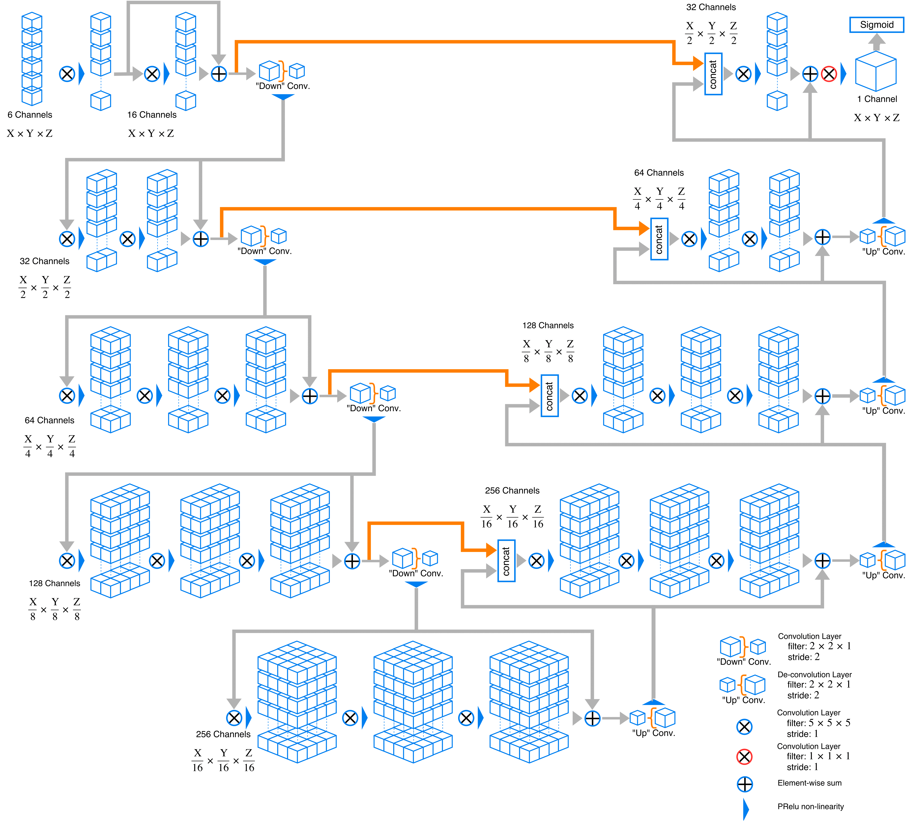

# V-Net Tensorflow
Tensorflow implementation of the V-Net architecture for medical imaging segmentation.

## Tensorflow implementation of V-Net
This is a Tensorflow implementation of the [V-Net](https://arxiv.org/abs/1606.04797) architecture used for 3D medical imaging segmentation. This code adopts the tensorflow graph from https://github.com/MiguelMonteiro/VNet-Tensorflow. The repository covers training, evaluation and prediction modules for the (multimodal) 3D medical image segmentation in multiple classes.

### Visual Represetation of Network
Here is an example graph of network this code implements. Channel depth may change owning to change in modality number and class number.


### Features
- 3D data processing ready
- Augumented patching technique, requires less image input for training
- Multichannel input and multiclass output
- Generic image reader with Nibabel support (Currently only support .nii/.nii.gz format for convenience, easy to expand to DICOM, tiff and jpg format)
- Medical image pre-post processing with Nibabel
- Easy network replacement structure
- Sørensen and Jaccard similarity measurement as golden standard in medical image segmentation benchmarking
- Utilizing medical image headers to retrive space and orientation info after passthrough the network

## Development Progress

- [x] Training
- [x] Tensorboard visualization and logging
- [x] Resume training from checkpoint
- [x] Epoch training
- [x] Evaluation from single data
- [x] Multichannel input
- [x] Multiclass output

## Usage
### Required Libraries
Known good dependencies
- Python 3.5
- Tensorflow 1.8 or above
- Nibabel
- mvloader

### Folder Hierarchy
All training, testing and evaluation data should put in `./data`

    .
    ├── ...
    ├── data                      # All data
    │   ├── testing               # Put all testing data here
    |   |   ├── case1            
    |   |   |   ├── img.nii.gz    # Image for testing
    |   |   |   └── label.nii.gz  # Corresponding label for testing
    |   |   ├── case2
    |   |   ├──...
    │   ├── training              # Put all training data here
    |   |   ├── case1             # foldername for the cases is arbitary
    |   |   |   ├── img.nii.gz    # Image for testing
    |   |   |   └── label.nii.gz  # Corresponding label for training
    |   |   ├── case2
    |   |   ├──...
    │   └── evaluation            # Put all evaluation data here
    |   |   ├── case1             # foldername for the cases is arbitary
    |   |   |   └── img.nii.gz    # Image for evaluation
    |   |   ├── case2
    |   |   ├──...
    ├── tmp
    |   ├── ckpt                  # Tensorflow checkpoints
    |   └── log                   # Tensorboard logging folder
    ├── ...
    

```python
image_filename = 'img.nii(.gz)'
label_filename = 'label.nii(.gz)'
```

In segmentation tasks, image and label are always in pair, missing either one would terminate the training process.

### Training

You may run Training.py with commandline arguments. To check usage, type ```python Training.py -h``` in terminal to list all possible training parameters.

Available training parameters
```console
  --data_location: Relative location of data folder insider working directory.
    (default: './files')
    (string)
  --train_folder: Directory of training data.
    (default: './train')
    (string)
  --test_folder: Directory of test data.
    (default: './test')
    (string)
  --files: Name of files to include.
    (default: ['t2_pp.nii','pd_pp.nii','mprage_pp.nii','flair_pp.nii'])
    (list of strings)
  --masks: Name of masks to include.
    (default: ['mask.nii'])
    (list of strings)
  --nclasses: Number of classes.
    (default: 2)
    (integer)
  --w: Subvolume size.
    (default: [80, 80, 80])
    (list of integers)
  --p: Padding size.
    (default: [5, 5, 5])
    (list of integers)
  --epochs: Number of epochs for training
    (default: '10000')
    (integer)
  --params: List of data augmentation methods with settings (['method', setting]), e.g. ['mirror', [0,1,2]].
    (default: None)
    (list of strings)
  --drop_out: DropOut probability.
    (default: 0.5)
    (float)
  --test_each: Validation frequency in epochs.
    (default: 2000)
    (integer)
  --checkpoint_dir: Directory where to write checkpoint
    (default: './tmp/ckpt')
  --decay_factor: Exponential decay learning rate factor
    (default: '0.01')
    (a number) (not implemented)
  --decay_steps: Number of epoch before applying one learning rate decay
    (default: '100')
    (an integer) (not implemented)
  --display_step: Display and logging interval (train steps)
    (default: '1000')
    (integer)
  --init_learning_rate: Initial learning rate
    (default: '0.1')
    (float)
  --save_interval: Checkpoint save interval (epochs)
    (default: '1000')
    (integer)
  --shuffle_buffer_size: Number of elements used in shuffle buffer
    (default: '5')
    (integer)
 ```

### Data Sampling

What the class does is basically random sampling within a image volume with provided size and padding. To this volume subsample, Gaussian-filtering can be applied and the original images together with the Gaussian-filtered versions are stacked in the channel dimension. Next, transformation are applied, if requested. The output is a tensor of shape (batch_size, nx, ny, nz, n_channels). Same holds for the masks. In addition, it is possible to selectively sample, i.e. that each n-th sample includes labelled data (by which the selectively sampled class can be determined). Read more about the inputs below.

**Be aware that each class in the masks will correspond to one channel, i.e. for two classes there will be two channels (and not one).**
            
#### Inputs

Optional inputs can be provided as dict (see example above).
    
##### Sampling

    whiten: perform Gaussian-filtering of images as type bool (default: True)
    
    subtractGaussSigma: standard deviation for Gaussian filtering as list of len 1 or ndims (default: [5])
    
    nooriginal: use only Gaussian-filtered images as type bool (default: False)
    
    each_with_labels: input of type int to fix the selective sampling interval, i.e. each n-th sample (default: 0, i.e. off)
    
    min_label: input of type int to fix which label/class to selectively sample (default: 1)
    
##### Data Augmentation

    deform: deformation grid spacing in voxels as list of len 1 or ndims with types int (default: [0])
    
    deformSigma: given a deformation grid spacing, this determines the standard deviations for each dimension of the random deformation vectors as list with length 1 or ndims with types float (default: [0])
    
    mirror: list input of len 1 or ndims of type bool to activate random mirroring along the specified axes during training (default: [0])
    
    rotation: list input of len 1 or ndims of type float as amount in radians to randomly rotate the input around a randomly drawn vector (default: [0])
    
    scaling: list input of len 1 or ndims of type float as amount ot randomly scale images, per dimension, or for all dimensions, as a factor, e.g. 1.25 (default: [0])
    
    shift: list input of len 1 or ndims of type int in order to sample outside of discrete coordinates, this can be set to 1 on the relevant axes (default: [0])
  
#### Tensorboard
In training stage, result can be visualized via Tensorboard. Run the following command:
```console
tensorboard --logdir=./tmp/log
```

Once TensorBoard is running, navigate your web browser to ```localhost:6006``` to view the TensorBoard.

Note: ```localhost``` may need to change to localhost name by your own in newer version of Tensorboard.

## References
Use the following Bibtex if you need to cite this repository:
```bibtex
@misc{jackyko1991_vnet_tensorflow,
  author = {Jacky KL Ko},
  title = {Implementation of vnet in tensorflow for medical image segmentation},
  howpublished = {\url{https://github.com/jackyko1991/vnet-tensorflow}},
  year = {2018},
  publisher={Github},
  journal={GitHub repository},
}

@inproceedings{milletari2016v,
  title={V-net: Fully convolutional neural networks for volumetric medical image segmentation},
  author={Milletari, Fausto and Navab, Nassir and Ahmadi, Seyed-Ahmad},
  booktitle={3D Vision (3DV), 2016 Fourth International Conference on},
  pages={565--571},
  year={2016},
  organization={IEEE}
}

@misc{MiguelMonteiro_VNet_Tensorflow,
  author = {Miguel Monteiro},
  title = {VNet-Tensorflow: Tensorflow implementation of the V-Net architecture for medical imaging segmentation.},
  howpublished = {\url{https://github.com/MiguelMonteiro/VNet-Tensorflow}},
  year = {2018},
  publisher={Github},
  journal={GitHub repository},
}
```

## Author
Georgi Tancev
